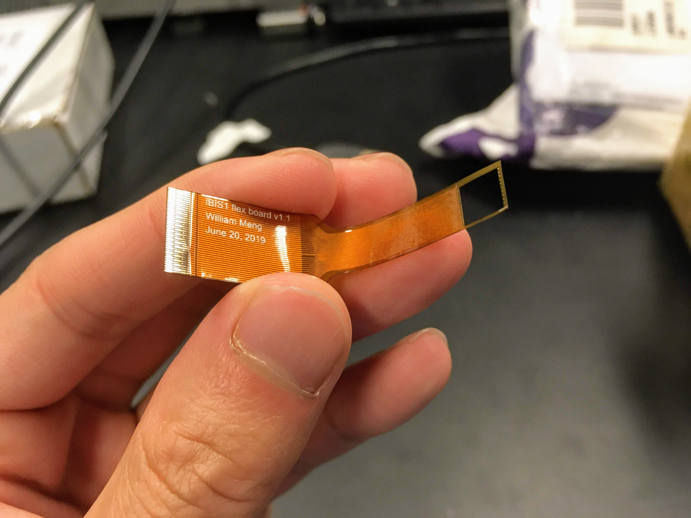

June 2019 
Columbia University Bioelectronic Systems Lab 

I designed a flexible PCB in 3 mil design rules to provide a flexible substrate for flip-chip bonding a flexible CMOS chip for implantable brain imaging.

  

    
  

  

    
  

  <a class="prev" onclick="plusSlides(-1)">❮</a>
  <a class="next" onclick="plusSlides(1)">❯</a>

  

    

  

  

    

      
    

    

      
    

  

<link rel="stylesheet" href="assets/css/gallery.css">

