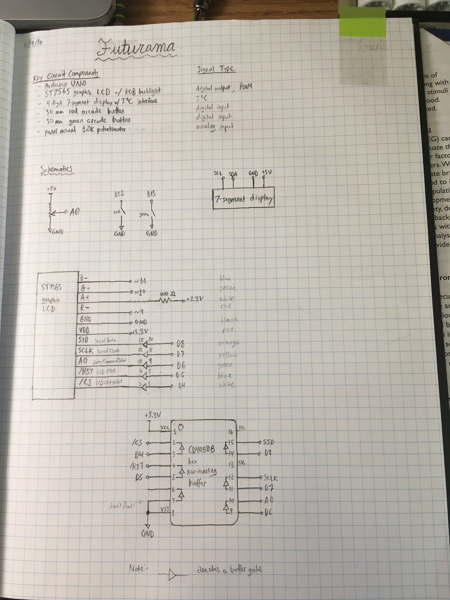
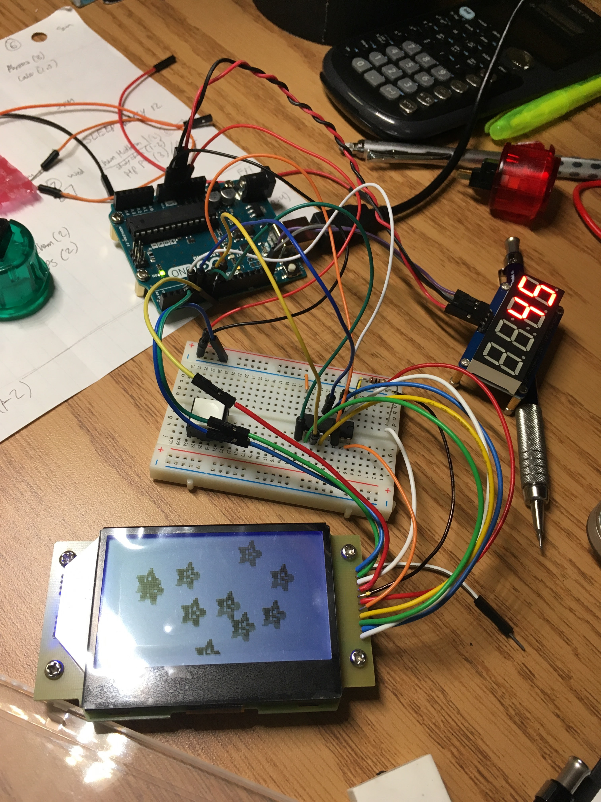
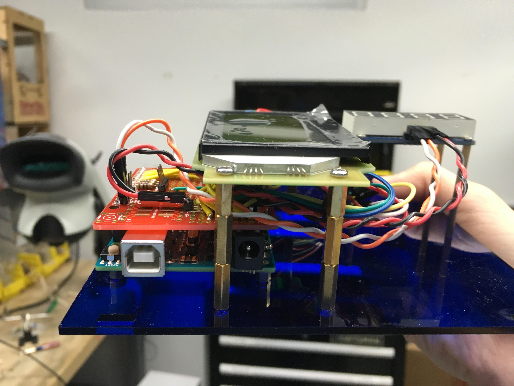

Dec 2016 
with [Perrin Jones](http://perrin-jones.com/), Meghna Gorrela, Gabby Jones, & Hidy Yi

[Code on Github](https://github.com/wlmeng11/futurama) 
[Featured on the @columbiaengineering Instagram](https://www.instagram.com/p/BcaSdyZla2W/)

Our project for the Art of Engineering class. We designed and fabricated an Arduino-based game, inspired by the classic arcade game Stacker. The game features a graphic LCD, score counter, speed dial, and fun-sized buttons, all enclosed within an illuminated acrylic casing.

  

    
  

  

    
  

  

    
  

  

    
  

  

    
  

  

    
  

  <a class="prev" onclick="plusSlides(-1)">❮</a>
  <a class="next" onclick="plusSlides(1)">❯</a>

  

    

  

  

    

      
    

    

      
    

    

      
    

    

      
    

    

      
    

    

      
    

  

<link rel="stylesheet" href="assets/css/gallery.css">

