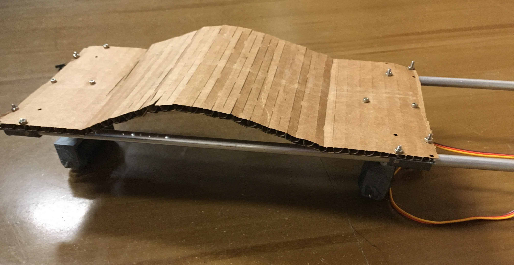
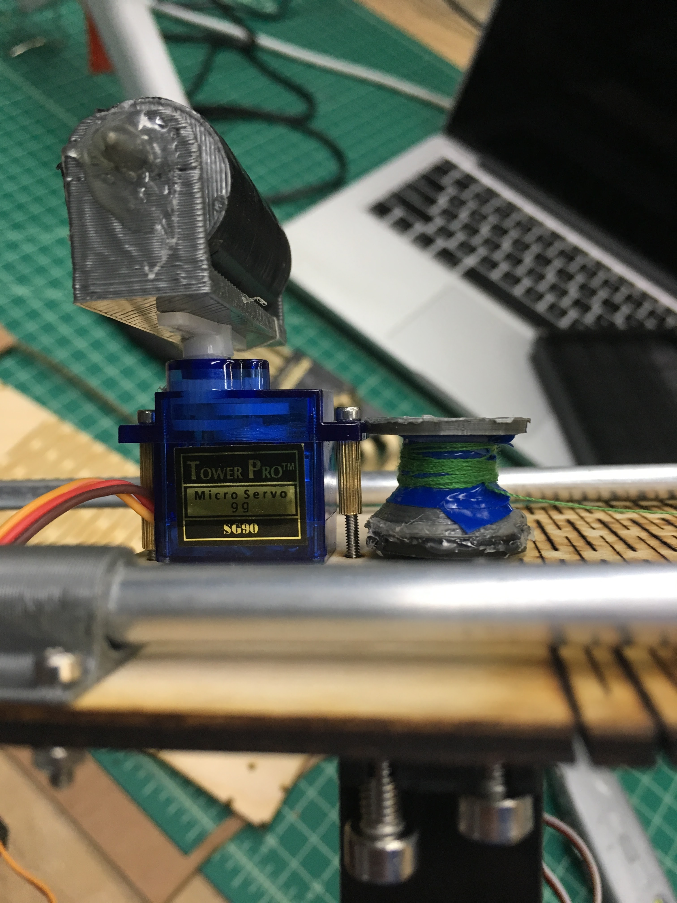
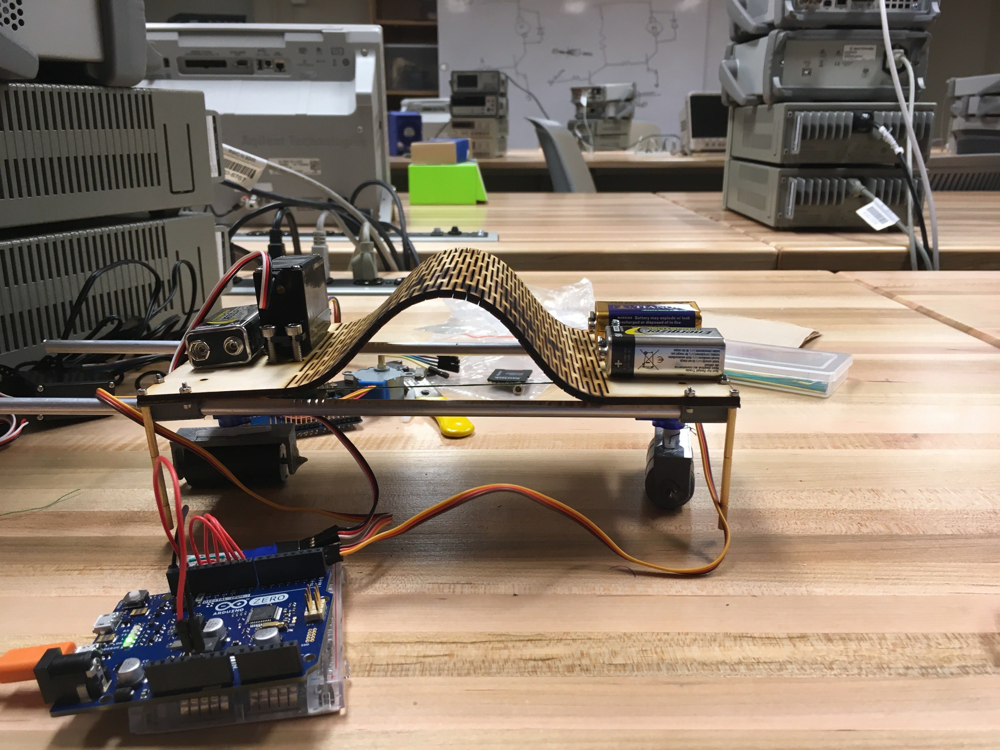

Feb 2017 
with Doga Ozesmi, Haley So, and Erica Jo

Created overnight for the MakeCU 2017 hardware hackathon. 
Awards: 2nd place overall, 1st place rookie team

The “back” of the inchworm is a sheet of plywood cut in such a way as to form a flexible [living hinge](https://www.ponoko.com/blog/how-to-make/how-to-design-a-living-hinge/). A continuous rotation servo winds a winch which serves to flex and release the inchworm’s back, causing it to slide along the metal rails. Finally, the “feet” of the inchworm are comprised of plastic rollers which are controlled by servo motors in order to either roll forward, or be held perpendicular to the direction of motion, thus serving as a locking mechanism.

<iframe width="560" height="315" src="https://www.youtube.com/embed/IfFF9oWX17U?rel=0" frameborder="0" allow="autoplay; encrypted-media" allowfullscreen></iframe>

<iframe width="560" height="315" src="https://www.youtube.com/embed/pit3s5Mq2Ro?rel=0" frameborder="0" allow="autoplay; encrypted-media" allowfullscreen></iframe>

<iframe width="560" height="315" src="https://www.youtube.com/embed/k6DmN1Q-_F8?rel=0" frameborder="0" allow="autoplay; encrypted-media" allowfullscreen></iframe>

  

    
  

  
  

    
  

  

    
  

  <a class="prev" onclick="plusSlides(-1)">❮</a>
  <a class="next" onclick="plusSlides(1)">❯</a>

  

    

  

  

    

      
    

    

      
    

    

      
    

  

<link rel="stylesheet" href="assets/css/gallery.css">

