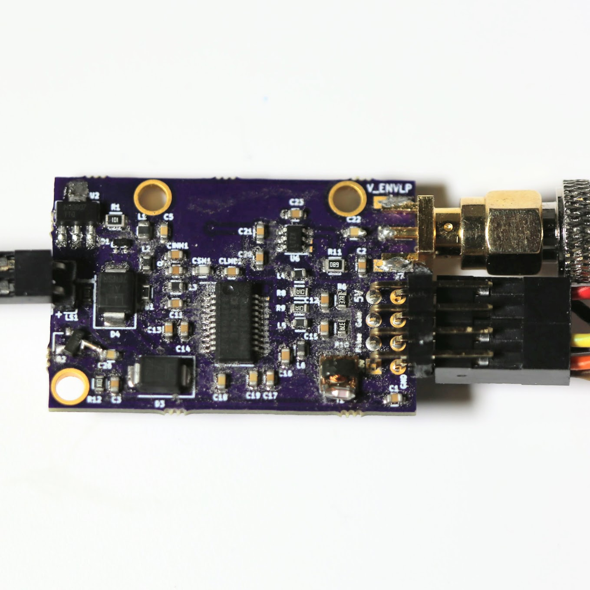
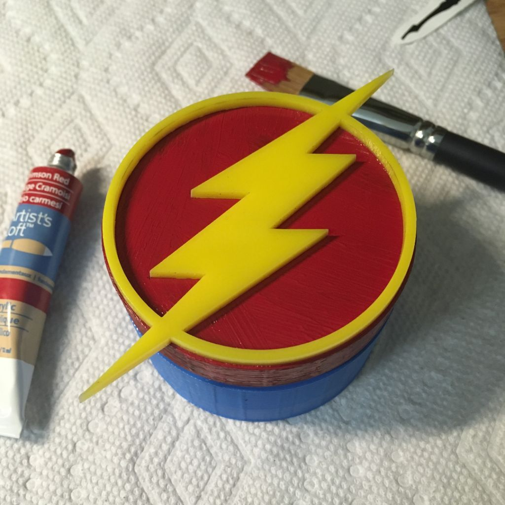
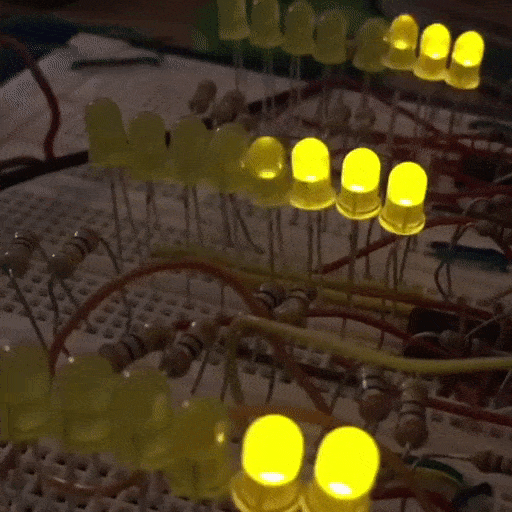

<!-- Section -->
<!-- <section>
	<header class="major">
		<h2>What I do</h2>
	</header>
	

		<article>
			
			

				<h3>Portitor ullamcorper</h3>
				
Aenean ornare velit lacus, ac varius enim lorem ullamcorper dolore. Proin aliquam facilisis ante interdum. Sed nulla amet lorem feugiat tempus aliquam.

			

		</article>
		<article>
			
			

				<h3>Sapien veroeros</h3>
				
Aenean ornare velit lacus, ac varius enim lorem ullamcorper dolore. Proin aliquam facilisis ante interdum. Sed nulla amet lorem feugiat tempus aliquam.

			

		</article>
		<article>
			
			

				<h3>Quam lorem ipsum</h3>
				
Aenean ornare velit lacus, ac varius enim lorem ullamcorper dolore. Proin aliquam facilisis ante interdum. Sed nulla amet lorem feugiat tempus aliquam.

			

		</article>
		<article>
			
			

				<h3>Sed magna finibus</h3>
				
Aenean ornare velit lacus, ac varius enim lorem ullamcorper dolore. Proin aliquam facilisis ante interdum. Sed nulla amet lorem feugiat tempus aliquam.

			

		</article>
	

</section> -->

<!-- Section -->
<section>
	<header class="major">
		<h2>Portfolio</h2>
	</header>
	

		<article>
			
			<h3>IBIS flex PCB</h3>
			
2019

		</article>
		<article>
			
			<h3>rtl-ultrasound</h3>
			
2018

		</article>
		<article>
			
			<h3>UltrasonOS</h3>
			
2017

		</article>
		<article>
			
			<h3>Copper Coaster</h3>
			
2017

		</article>
		<article>
			
			<h3>Inchworm</h3>
			
2017

		</article>
		<article>
			
			<h3>Shift Register Visualizer</h3>
			
2017

		</article>
		<article>
			
			<h3>The Flash Box</h3>
			
2016

		</article>
		<article>
			
			<!-- <a href="{{ 'music_visualizer.html' | absolute_url }}" class="image">
			<video width="auto" loop="true" autoplay="autoplay" muted>
			<source src="assets/images/Music_visualizer.mp4" type="video/mp4" />
			</video>
			</a> -->
			<h3>Music Visualizer</h3>
			
2016

		</article>
		<article>
			
			<h3>Futurama</h3>
			
2016

		</article>
		<article>
			
			<h3>Sketchbook</h3>
			
2016

		</article>
		<article>
			
			<h3>Graduation Cap</h3>
			
2016

		</article>
	

</section>
