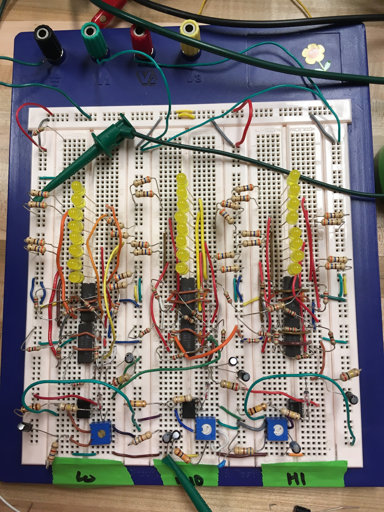

Dec 2017 
with Luis Collado

A 3-band audio music visualizer built on a breadboard for our ELEN 1201 final project. Each band consists of an RC filter, diode peak detector, amplifier stage, and a flash ADC using comparators.

<iframe width="560" height="315" src="https://www.youtube.com/embed/OAprvrdoSRs?rel=0" frameborder="0" allow="autoplay; encrypted-media" allowfullscreen></iframe>

  

    
  

  <a class="prev" onclick="plusSlides(-1)">❮</a>
  <a class="next" onclick="plusSlides(1)">❯</a>

  

    

  

  

    

      
    

  

<link rel="stylesheet" href="assets/css/gallery.css">

