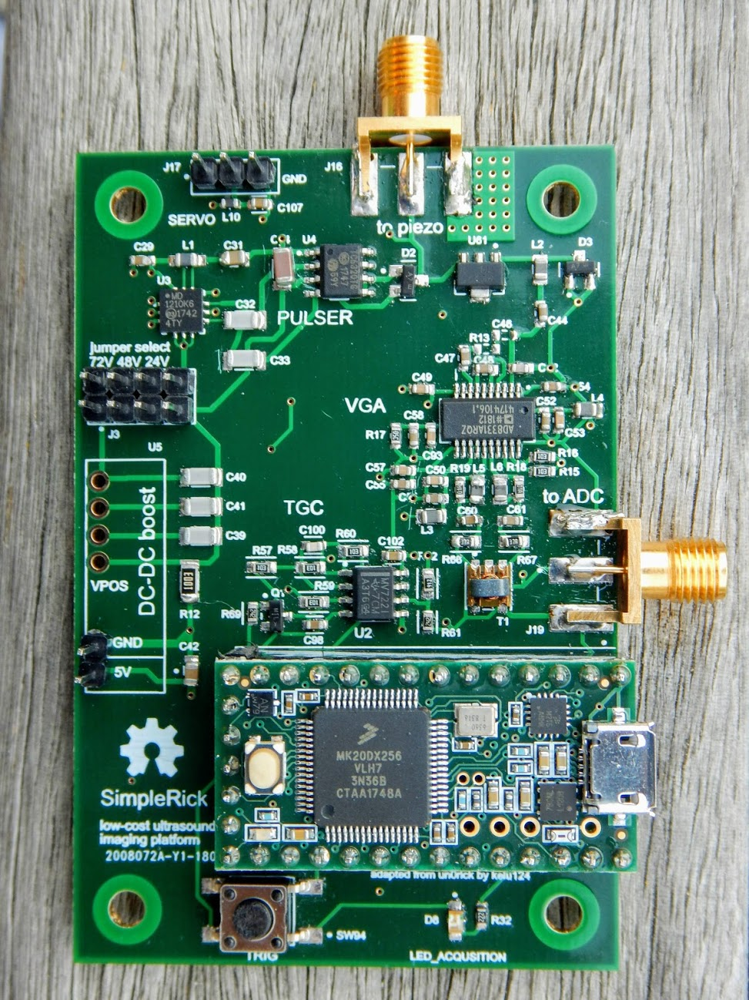
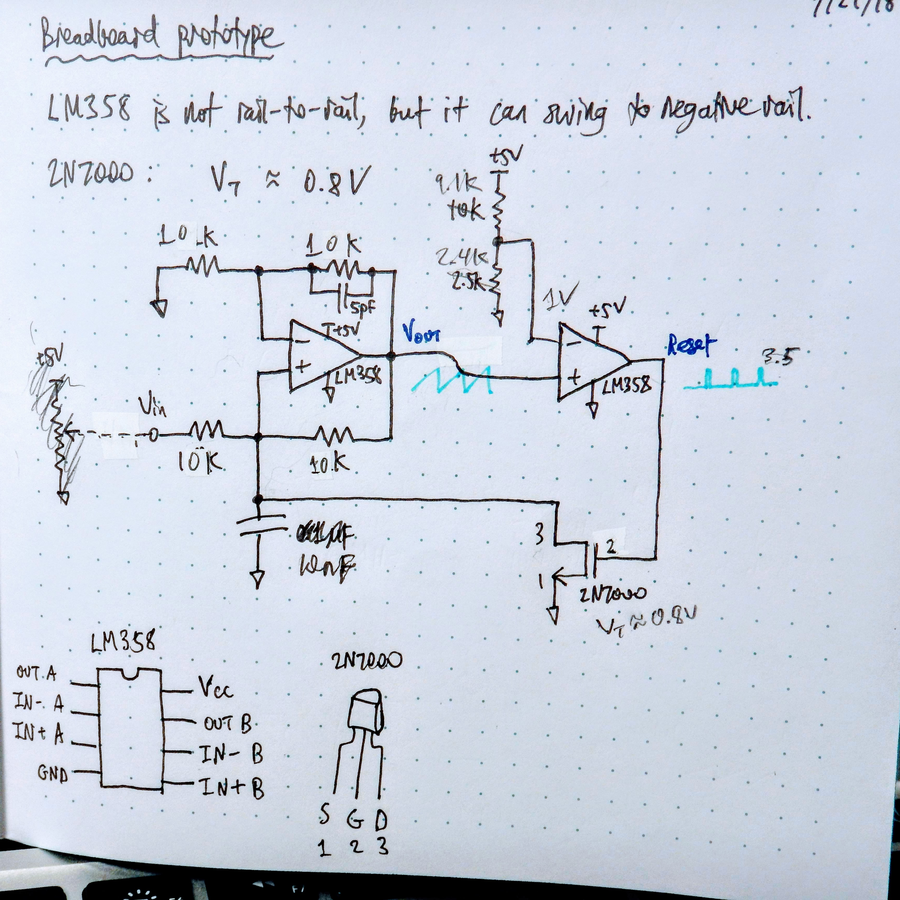
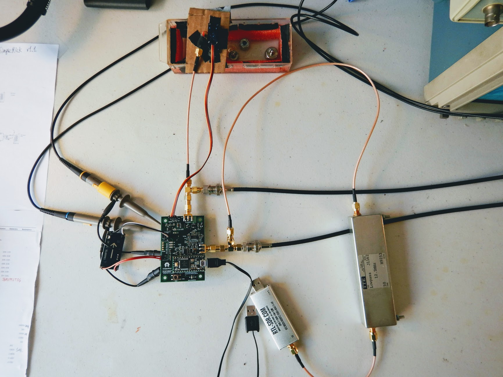
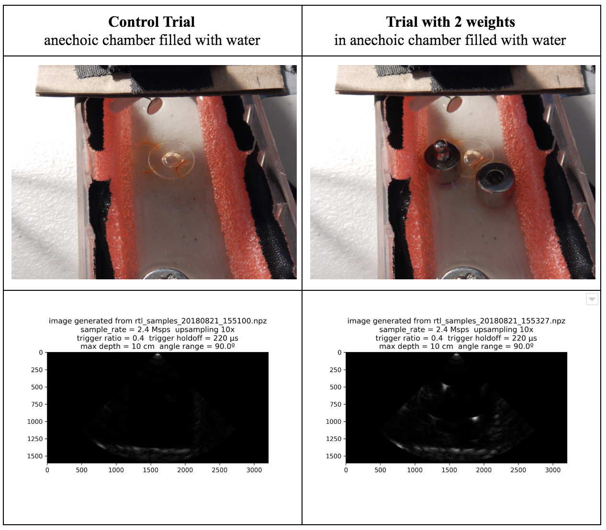

July - August 2018

rtl-ultrasound is the first-ever ultrasound imaging system based on consumer-grade Software Defined Radio (SDR) hardware.
The goal of this project is to provide hardware and software to perform 2D ultrasound imaging at a cost affordable to makers and electronics hobbyists.

It consists of 3 subprojects:

| Subproject 	| Name                	| Description                                                                                                                                          	|
|------------	|---------------------	|------------------------------------------------------------------------------------------------------------------------------------------------------	|
| Hardware   	| [SimpleRick](https://github.com/wlmeng11/SimpleRick)          	| A modified version of kelu124's [un0rick](http://un0rick.cc/) PCB, using the RTL-SDR to offload data acquisition and processing to a software.                             	|
| Firmware   	| [SimpleRick_firmware](https://github.com/wlmeng11/SimpleRick_firmware) 	| Allows the Teensy 3.2 microcontroller to perform system calibration and control various parameters of the experimental setup, configurable over USB. 	|
| Software   	| [rtl-ultrasound](https://github.com/wlmeng11/rtl-ultrasound)      	| A Python package containing the scripts for signal and image processing.                                                                             	|

I came up with the idea for this project one day when I realized that the extraction of amplitude information (used in B-mode ultrasound) and phase information (used in Doppler mode ultrasound) is mathematically equivalent to the demodulation of radio signals.
Therefore, it's possible to use radio hardware to replace many components of traditional ultrasound hardware.
And thanks to cheap and flexible SDR devices such as RTL-SDR, much of the hardware used in radio demodulation can be replaced by software.

Drawing upon my experience from [UltrasonOS](ultrasonos.html) and my knowledge as a licensed Ham radio operator,
I spent most of my free time outside of my job working on this project at home, and was able to go from idea to working prototype in the span of a month.

Explanations, photos, and diagrams can be found on Github, particularly on these pages:
* [SimpleRick PCB v1.1](https://github.com/wlmeng11/SimpleRick/blob/master/hardware/v1.1/README.md)
* [HackRF ultrasound signal simulator](https://github.com/wlmeng11/SimpleRick/blob/master/experiments/20180807/hackrf_ultrasound_simulator.ipynb)
* [Signal processing test code](https://github.com/wlmeng11/rtl-ultrasound/blob/master/experiments/20180813/rtlsdr_ultrasound_test.ipynb)
* [initial experimental results](https://github.com/wlmeng11/rtl-ultrasound/blob/master/experiments/20180818/rtlsdr_ultrasound_test.ipynb)
* [experimental results](https://github.com/wlmeng11/rtl-ultrasound/blob/master/experiments/20180821/README.md)

  

    
  

  

    
  

  

    
  

  

    
  

  <a class="prev" onclick="plusSlides(-1)">❮</a>
  <a class="next" onclick="plusSlides(1)">❯</a>

  

    

  

  

    

      
    

    

      
    

    

      
    

    

      
    

  

<link rel="stylesheet" href="assets/css/gallery.css">

