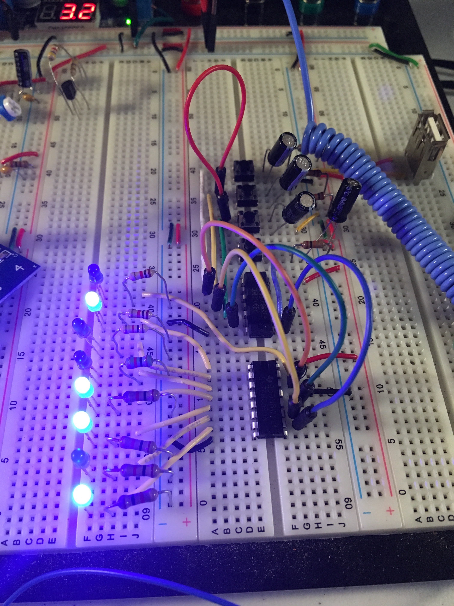

Feb 2017

My first ever PCB design! Initially prototyped on a breadboard, then drawn in Kicad and fabricated with an Othermill. The data, clock, enable, and reset pins are controlled with pushbuttons. Each pushbutton is debounced with a capacitor and Schmitt trigger.

<iframe width="560" height="315" src="https://www.youtube.com/embed/w-Q5RRrkMQk?rel=0" frameborder="0" allow="autoplay; encrypted-media" allowfullscreen></iframe>

  

    
  

  

    
  

  

    
  

    
  <a class="prev" onclick="plusSlides(-1)">❮</a>
  <a class="next" onclick="plusSlides(1)">❯</a>

  

    

  

  

    

      
    

    

      
    

    

      
    

  

<link rel="stylesheet" href="assets/css/gallery.css">

