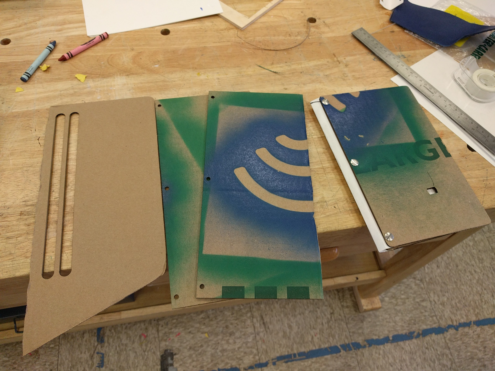
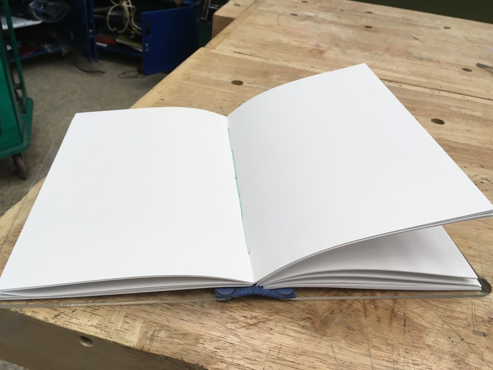

Dec 2016

A DIY sketchbook, featuring lasercut acrylic covers, a faux leather spine, and hand-bound pages.
The [5 hole pamphlet stitch](http://www.designsponge.com/2013/03/bookbinding-101-five-hole-pamphlet-stitch.html)
allows the pages to lay flat when the notebook is open.

  

    
  

  

    
  

  <a class="prev" onclick="plusSlides(-1)">❮</a>
  <a class="next" onclick="plusSlides(1)">❯</a>

  

    

  

  

    

      
    

    

      
    

  

<link rel="stylesheet" href="assets/css/gallery.css">

