December 2019 
with [Haley So](https://haleyso.github.io/) 

For the final design project of Prof. Ken Shepard's (in)famous [Digital VLSI course](https://www.bioee.ee.columbia.edu/courses/ee4321/),
we designed and layed out an entire 8-bit microcontroller core
in Cadence Virtuoso for IBM's 90 nm CMOS process (cms9flp).

  

    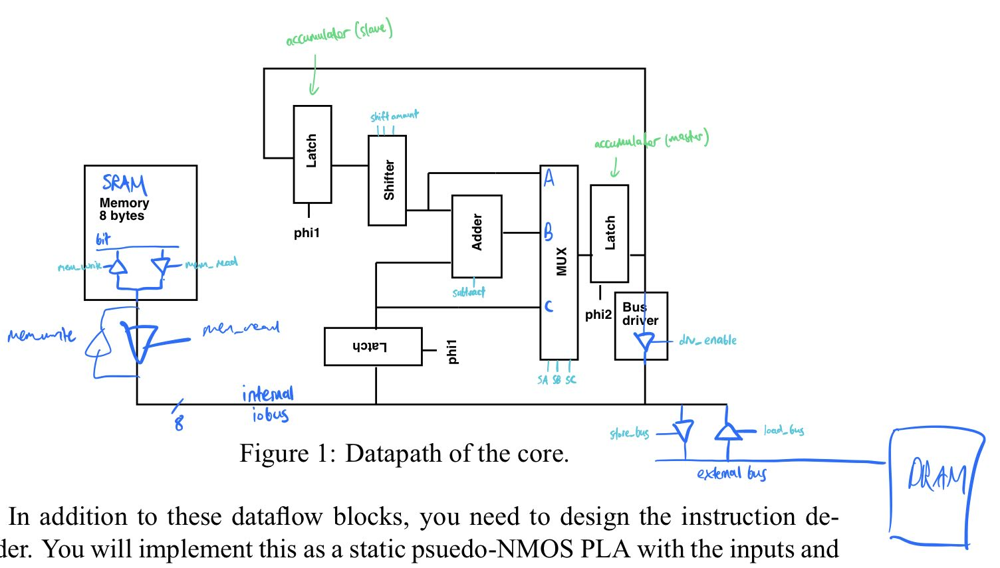
  

  

    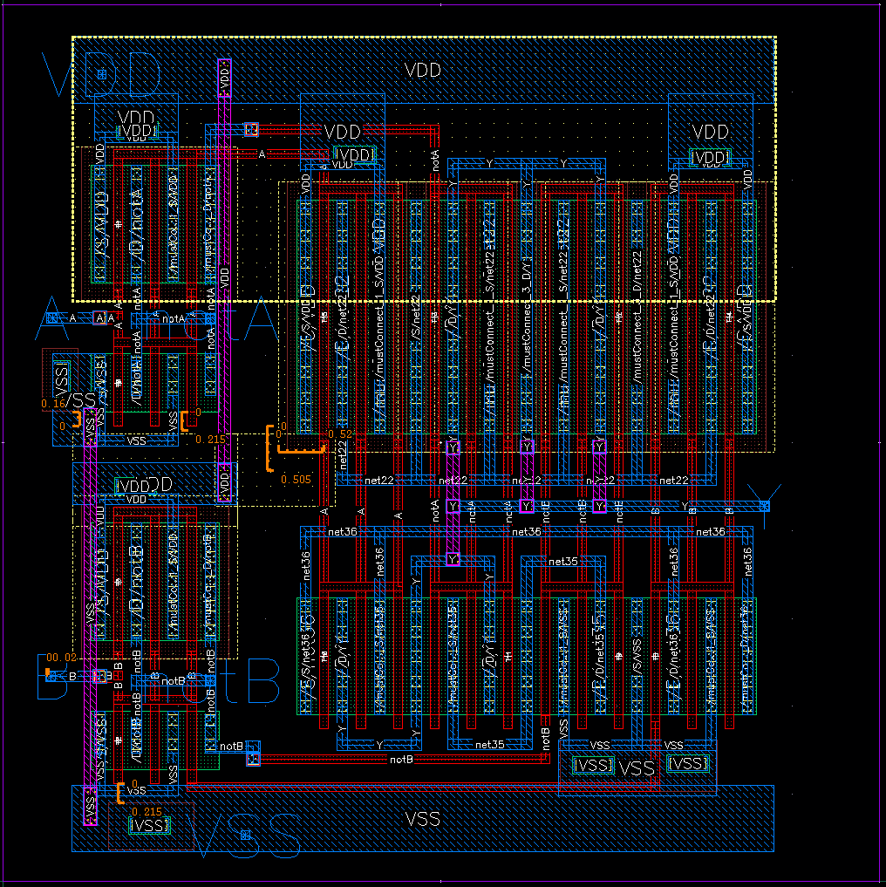
  

  

    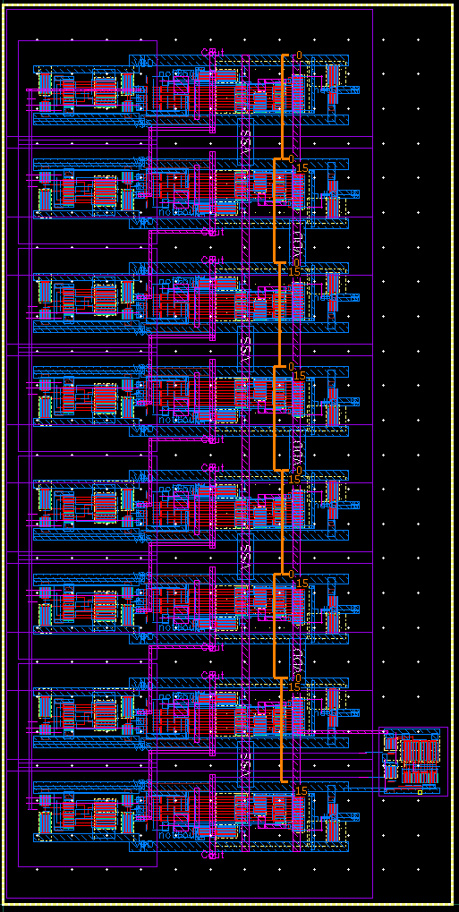
  

  

    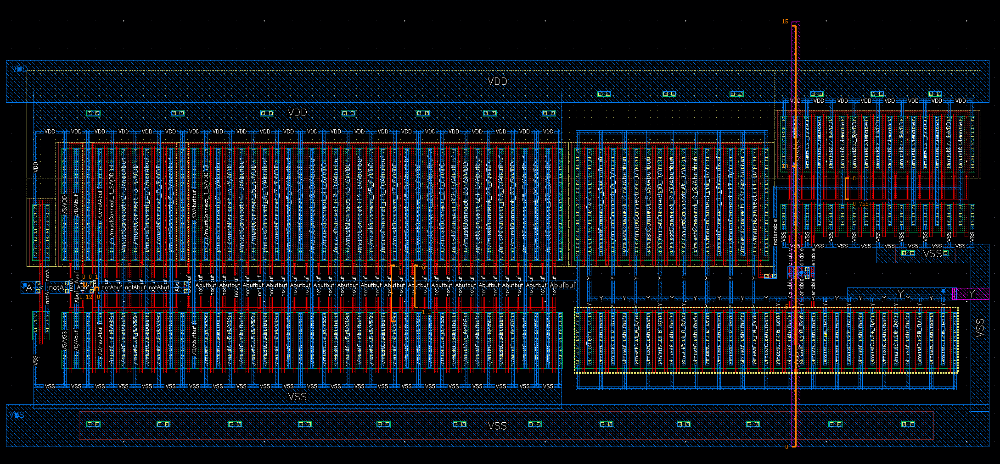
  

  

    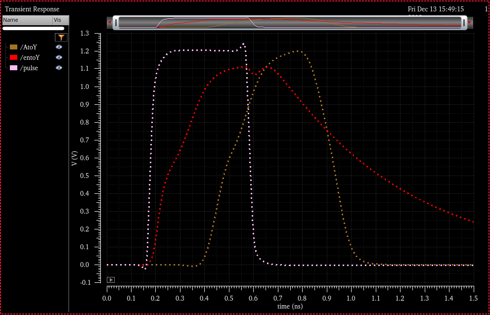
  

  

    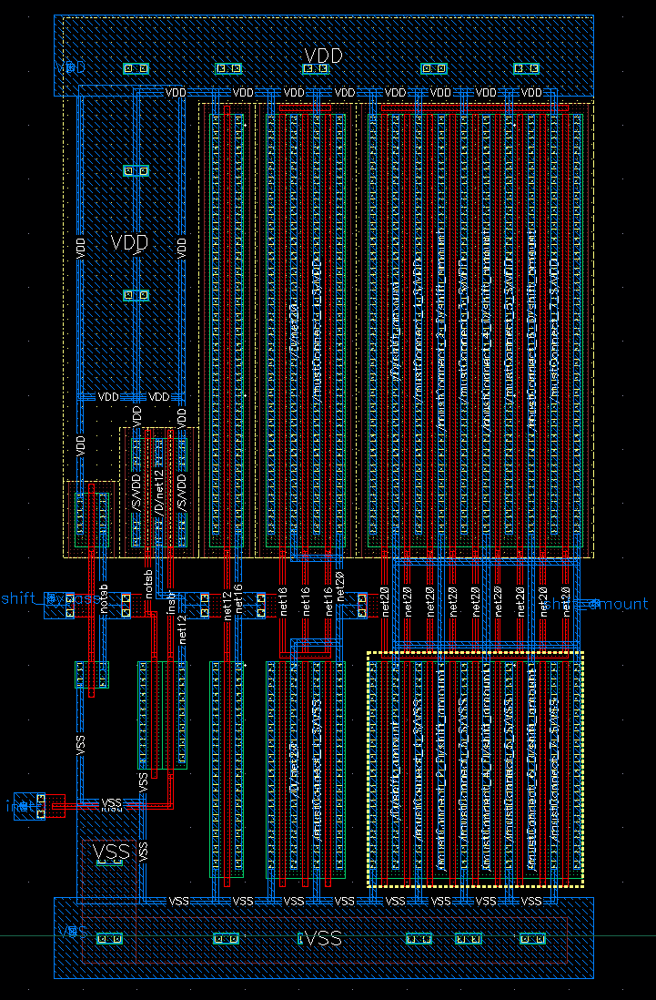
  

  

    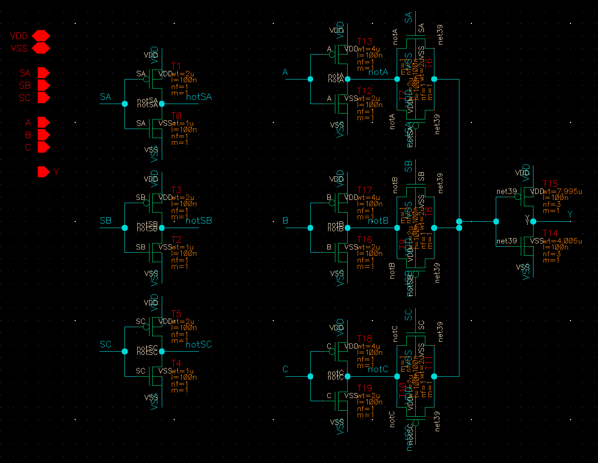
  

  

    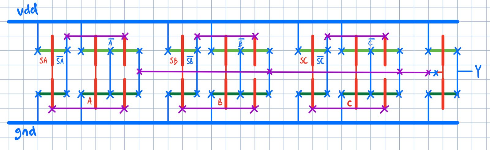
  

  

    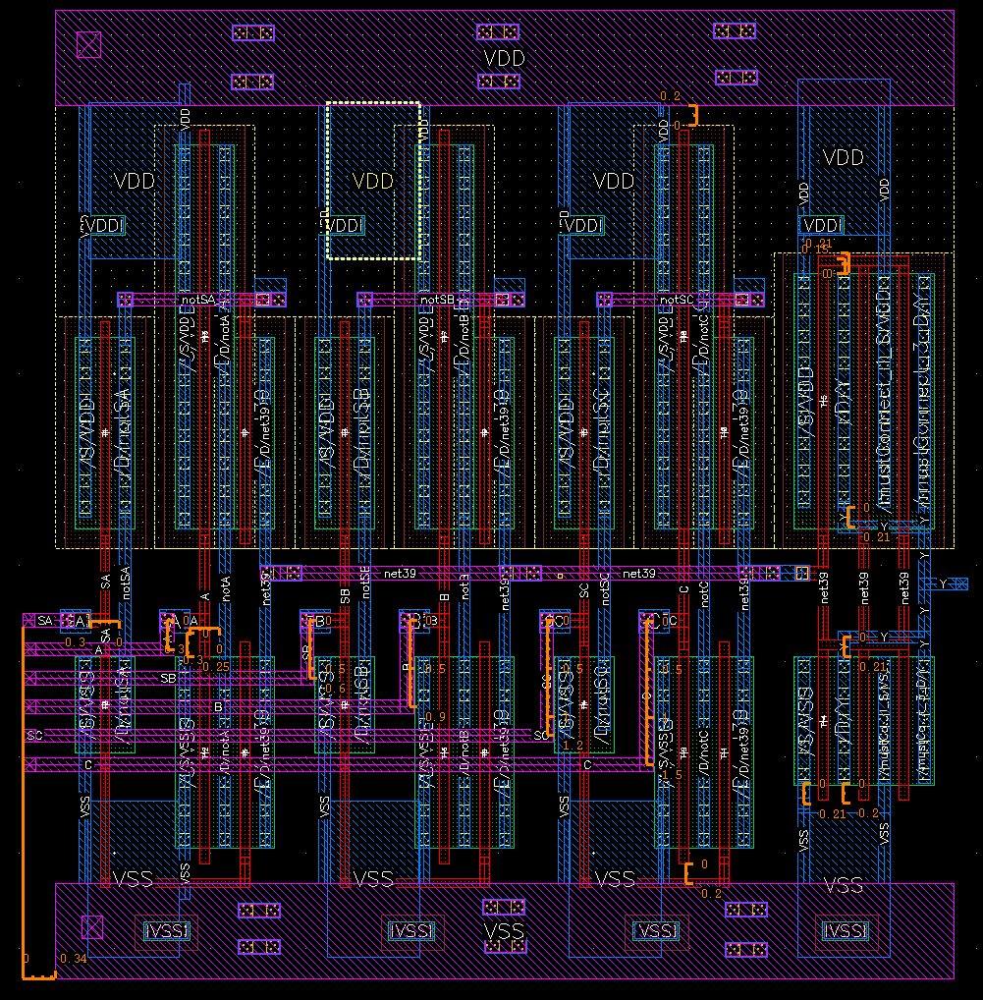
  

  

    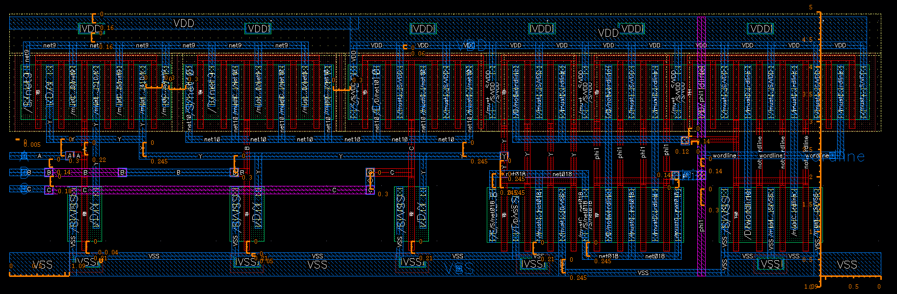
  

  

    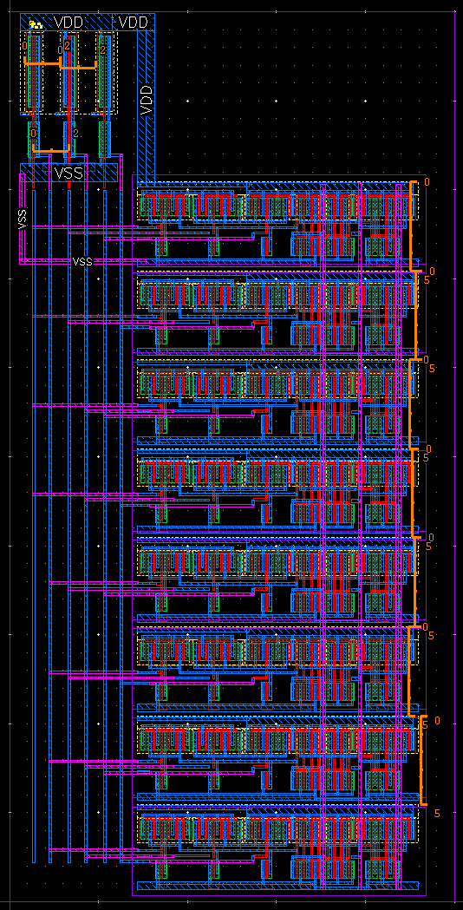
  

  

    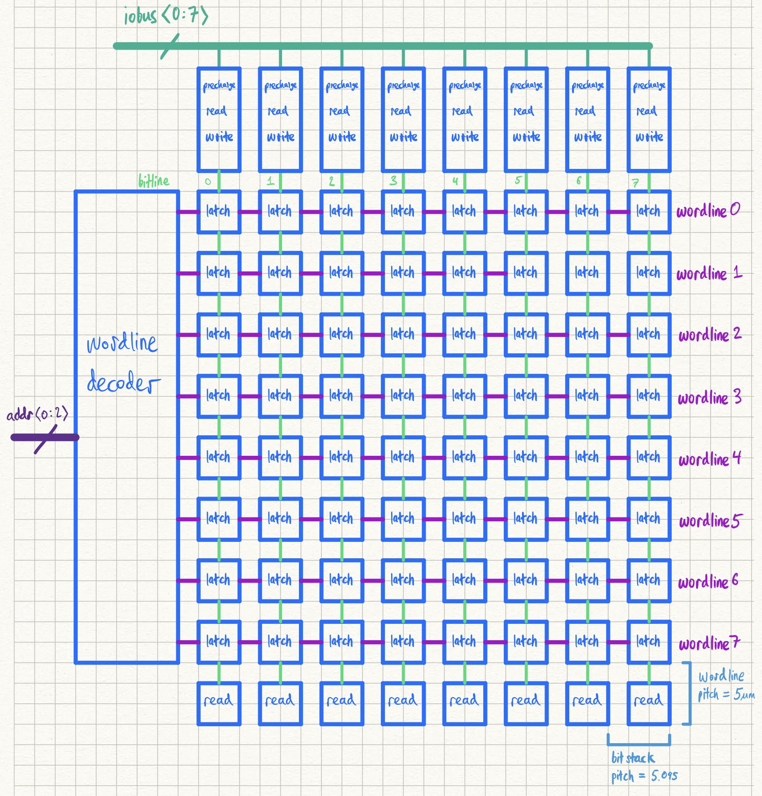
  

  

    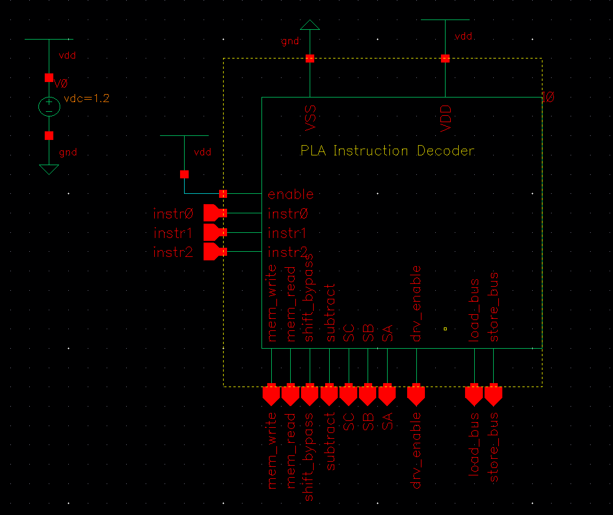
  

  

    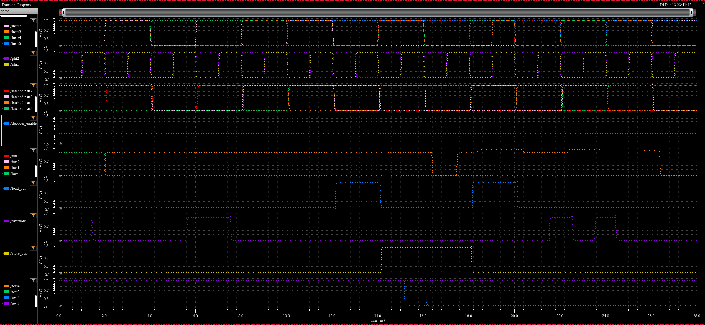
  

  

    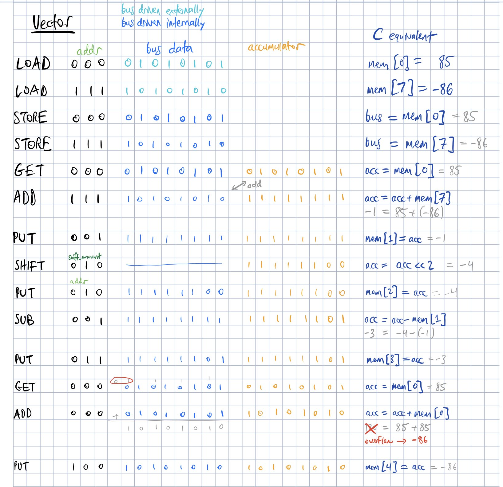
  

  <a class="prev" onclick="plusSlides(-1)">❮</a>
  <a class="next" onclick="plusSlides(1)">❯</a>

  

    

  

  

    

      
    

    

      
    

    

      
    

    

      
    

    

      
    

    

      
    

  

  

    

      
    

    

      
    

    

      
    

    

      
    

    

      
    

    

      
    

  

  

    

      
    

    

      
    

    

      
    

  

<link rel="stylesheet" href="assets/css/gallery.css">

