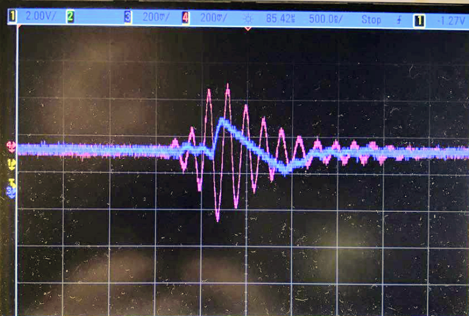

February - December 2017 
with Yazmin Feliz et al 
(Columbia University Creative Machines Lab) 

We are developing a low cost, open source device called UltrasonOS with the aim of drastically reducing the barrier of access to life-saving ultrasound imaging technology. I created the initial PCB designs and subsequently managed a subteam to iterate upon the PCB designs while I also took on a large part of the microcontroller programming.

*Designs and code on Github:*
* [Analog Frontend](https://github.com/ColumbiaOpenSourceUltrasound/Analog_Frontend) - A transceiver circuit for 5 MHz ultrasonic imaging using a piezoelectric transducer. It utilizes the [AD8331](http://www.analog.com/media/en/technical-documentation/data-sheets/AD8331_8332_8334.pdf) Variable Gain Amplifier from Analog Devices and [LTC5507](http://cds.linear.com/docs/en/datasheet/5507f.pdf) RF Power Detector from Linear Technology.
* [Nucleo DAQ Shield](https://github.com/ColumbiaOpenSourceUltrasound/Nucleo_DAQ_Shield) - A mixed signal PCB that houses connectors and auxiliary circuitry (buffers, H-bridge, voltage regulators). It allows the STM32 microcontroller to interface with the Analog Frontend, motor, and other sensors.
* [Code for STM32](https://github.com/ColumbiaOpenSourceUltrasound/UltrasonOS_STM32) - Performs high speed data acquisition and UDP data streaming to a client computer. I somehow managed to preserve my sanity as I journeyed through the thousand-page depths of STM32 documentation.

We designed the PCBs in [Kicad](http://kicad-pcb.org/) and utilized a combination of the [mbed](https://os.mbed.com/) and HAL libraries for the STM32 code. We ordered PCBs and stencils from [OSH Park](https://oshpark.com/) and [OSH Stencils](https://www.oshstencils.com/), respectively.

  

    
  

  

    
  

  

    
  

  

    
  

  

    
  

  

    
  

  <a class="prev" onclick="plusSlides(-1)">❮</a>
  <a class="next" onclick="plusSlides(1)">❯</a>

  

    

  

  

    

      
    

    

      
    

    

      
    

    

      
    

    

      
    

    

      
    

  

<link rel="stylesheet" href="assets/css/gallery.css">

