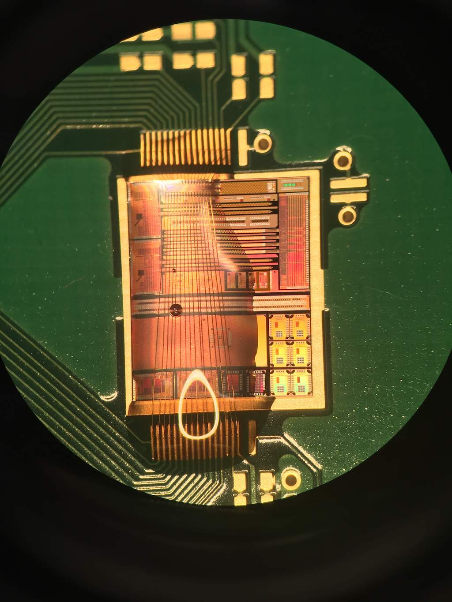
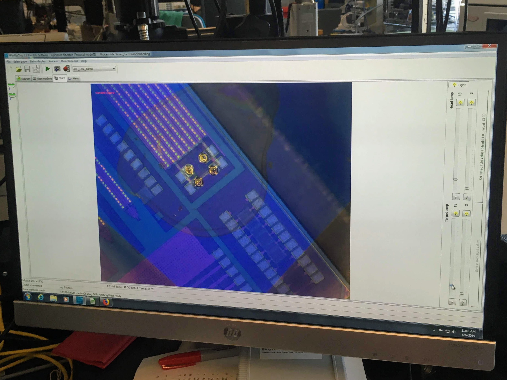
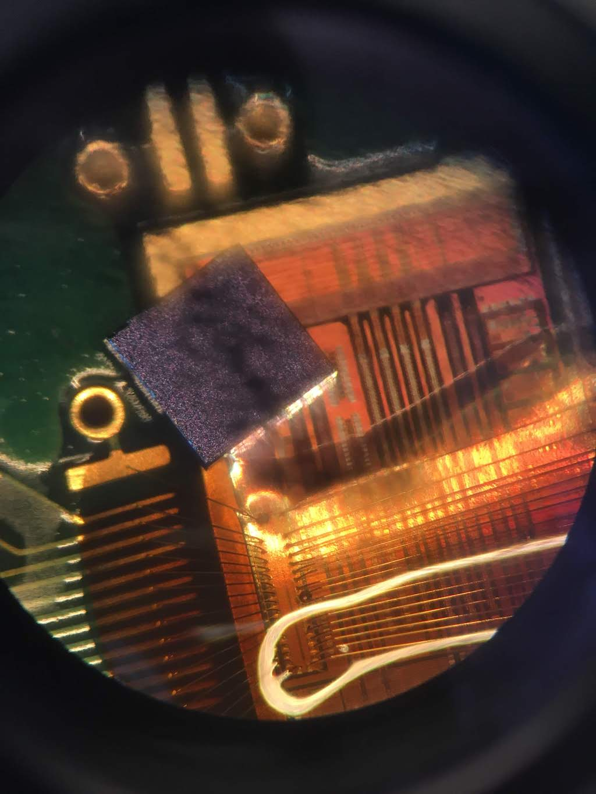
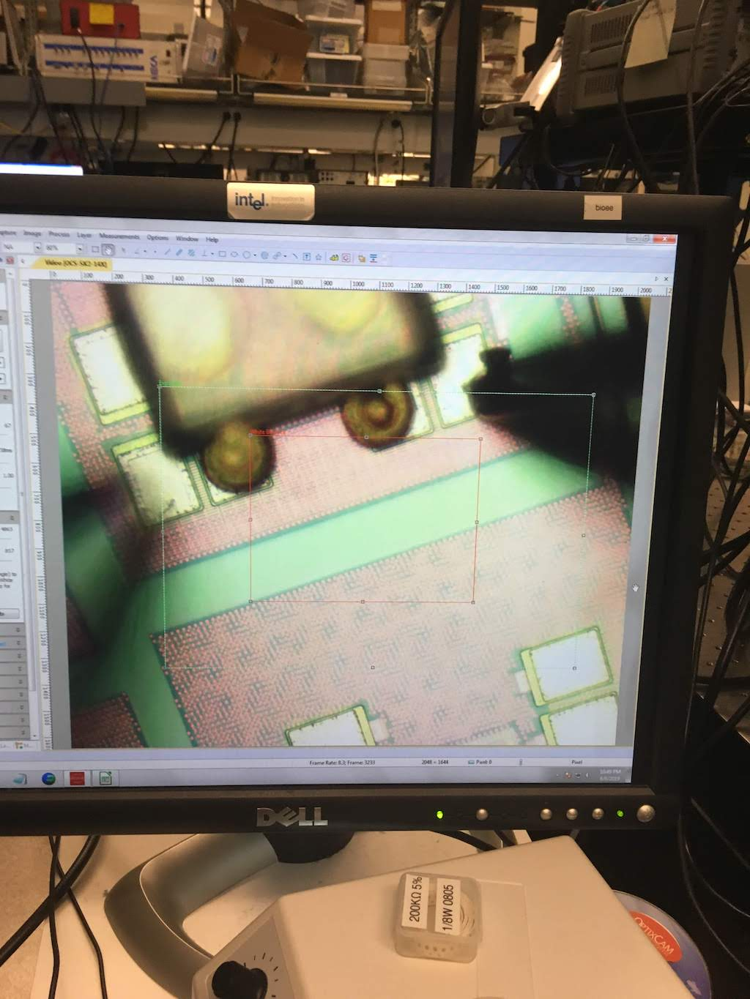
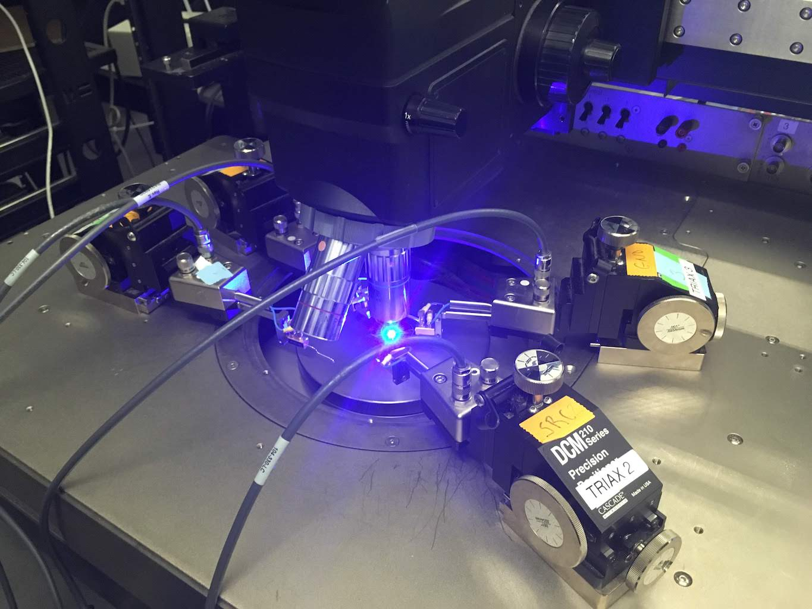
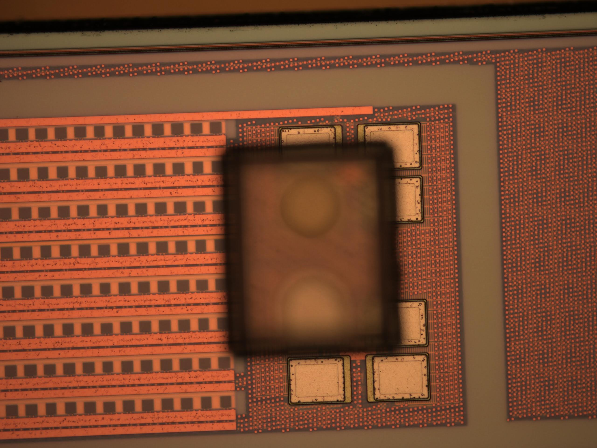
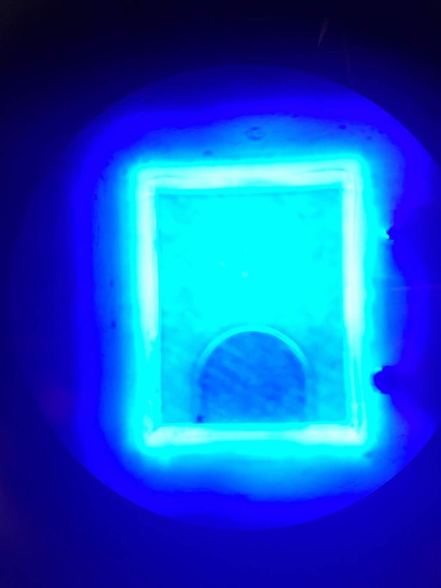
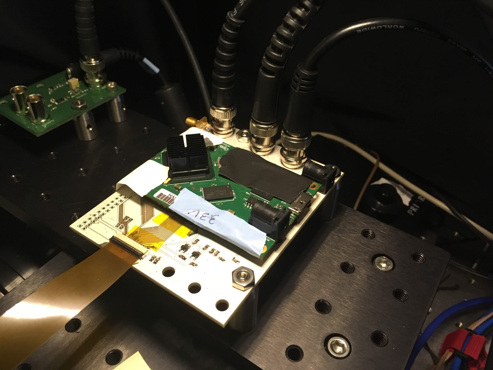
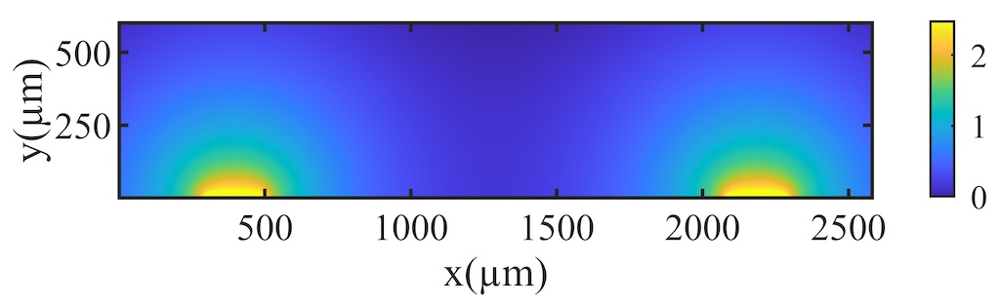
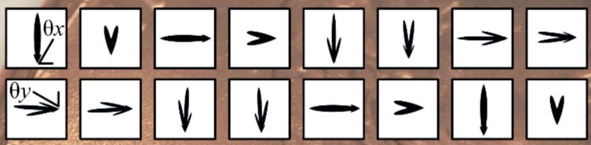

(top image by Jaebin Choi)

June 2019 
with Jaebin Choi et al (Columbia University [Bioelectronic Systems Lab](https://bioeeweb.ee.columbia.edu/wordpress/)) 

I joined Prof. Ken Shepard's Bioelectronic Systems Lab during my junior year
to work on next-generation neural interfaces based on Single Photon Avalanche Diode (SPAD) photodetectors,
which offer unrivaled speed and resolution compared to electric and magnetic field sensors.

The imager chip was fabricated in TSMC's 130 nm BCD process.
It integrates microLED illuminators and SPAD photodetectors into a needle-like form factor
in order to perform fluorescence lifetime imaging of deep tissue in a mouse brain.
Because the microscale form factor of the system prohibits a physical lens to focus the light,
a compressed sensing scheme which utilizes an ensemble of angular-sensitive pixels
(based on a variety of Talbot diffraction gratings)
allows for computational focusing and reconstruction of a 3D image.

I assembled and tested the PCBs, collected data, and created simulations and plots that were included in my co-authored paper,
which won the award for second best paper at the 2019 IEEE Biomedical Circuits and Systems (BioCAS) conference,
a premier international conference in the field of bioelectronics.

*Publications*:
* J. Choi, A. Taal, E. Pollmann, **W. Meng**, S. Moazeni, L. Moreaux, M. Roukes, K. Shepard, "[Fully Integrated Time-Gated 3D Fluorescence Imager for Deep Neural Imaging](https://bioeeweb.ee.columbia.edu/wordpress/wp-content/uploads/2019/11/8279.pdf)," IEEE Biomedical Circuits and Systems (BioCAS), October 18, 2019.

*Awards*:
* *2nd place* paper at BioCAS conference
* Invited paper (in preparation) for Special Issue of IEEE Transactions on Biomedical Circuits and Systems (TBioCAS) 2020.

  

    
  

  

    
  

  

    
  

  

    
  

  

    
  

  

    
  

  

    
  

  

    
  

  

    
  

  

    
  

  <a class="prev" onclick="plusSlides(-1)">❮</a>
  <a class="next" onclick="plusSlides(1)">❯</a>

  

    

  

  

    

       The world's smallest stringed instrument</strike> Test chip (not diced) wirebonded to daughterboard">
    

    

      
    

    

      
    

    

      
    

    

      
    

    

      
    

  

  

    

      
    

    

      
    

    

      
    

    

      
    

  

<link rel="stylesheet" href="assets/css/gallery.css">

